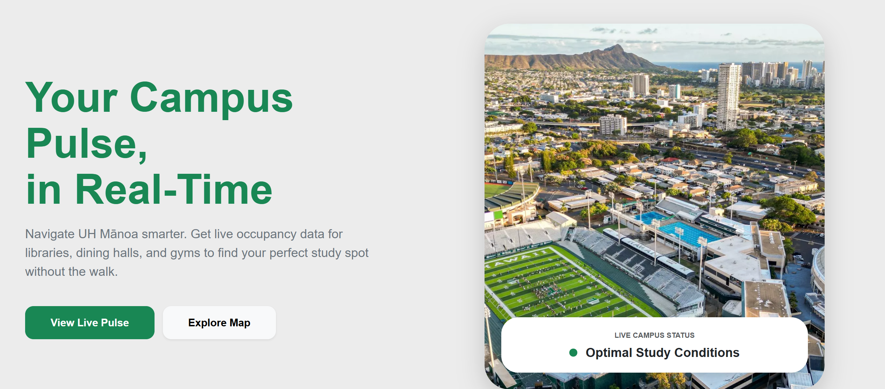
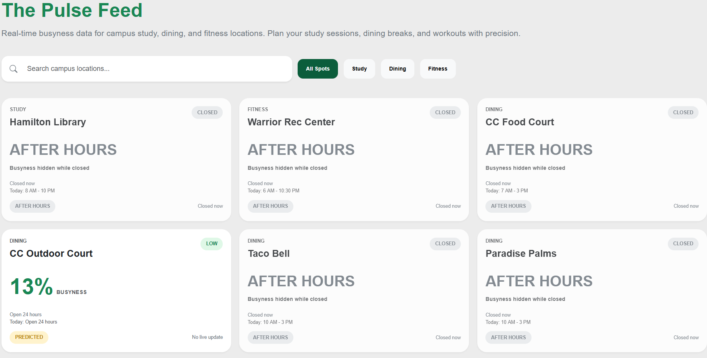
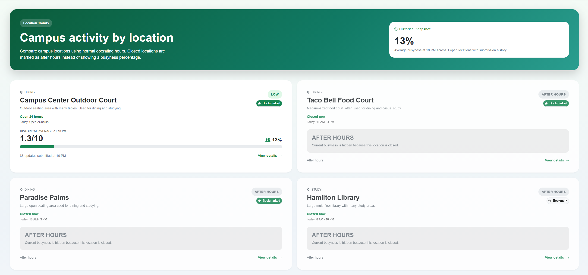
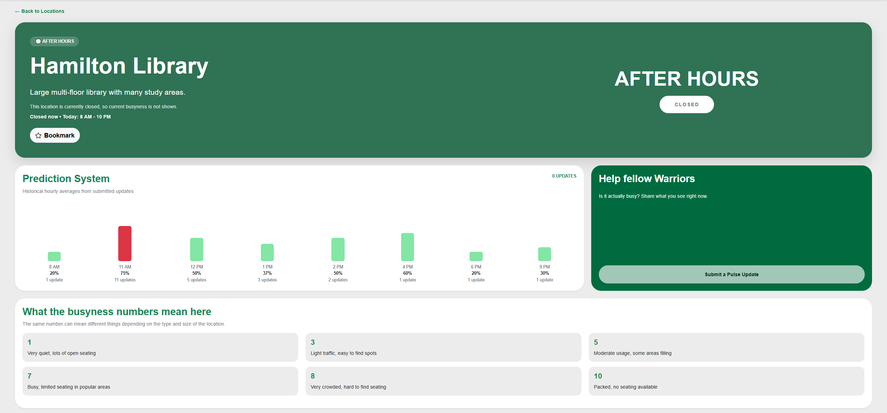
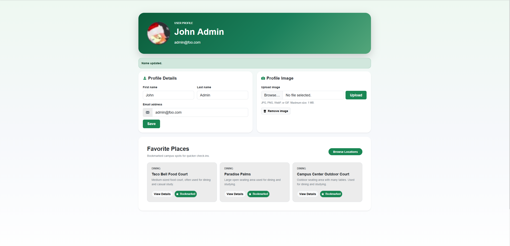
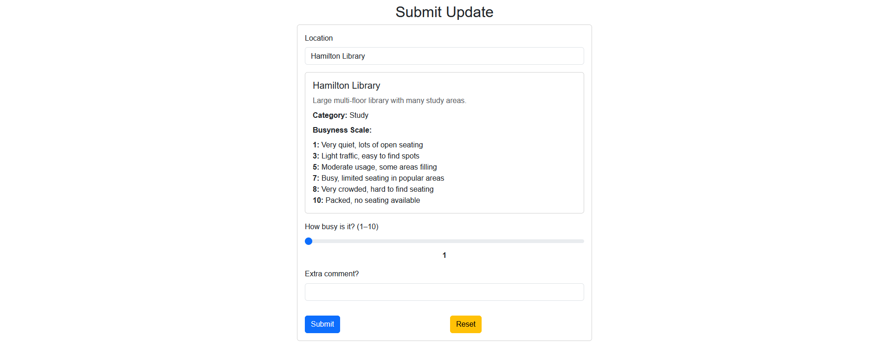
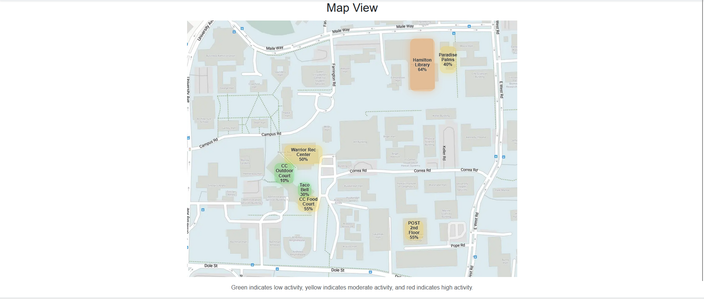
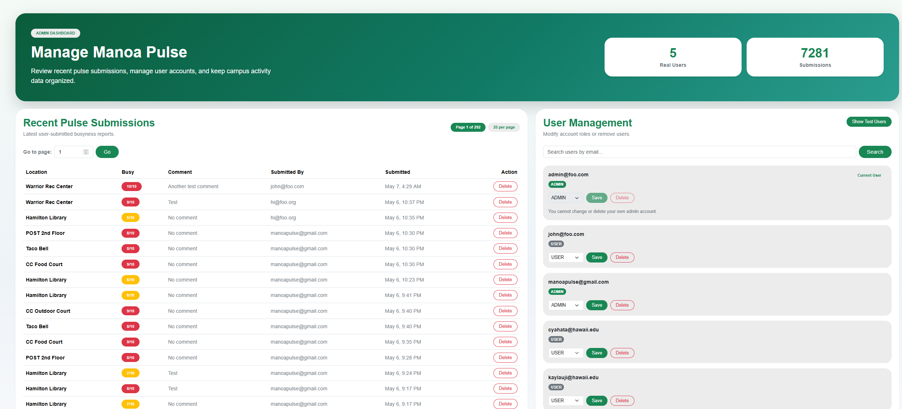

# Manoa Pulse

By Oscar Tio, Sebastian Wheelehan, Nathan Wong

---

## Overview

**Problem:**  
Students often struggle to find available spaces on campus for studying, eating, or meeting. Popular locations such as libraries, dining areas, and study lounges can become overcrowded, leading to wasted time and frustration. Currently, there is no centralized way for students to check how busy a location is before going there.

**Solution:**  
Manoa Pulse is a web-based platform that allows students to view and provides near real-time estimates based on recent user-submitted updates at various locations across the University of Hawaiʻi at Mānoa campus. By combining user-submitted updates with aggregated data, the system provides a live estimate of how busy a place is. The platform also includes an interactive campus heat map that visualizes busyness levels using color-coded zones.

---

## Deployment

- Live App: [Manoa Pulse](https://manoa-pulse-one.vercel.app/) [](https://github.com/manoa-pulse/manoa-pulse/actions/workflows/ci.yml)
- [GitHub Organization](https://github.com/manoa-pulse)  
- GitHub Pages: [Project Site](https://manoa-pulse.github.io)  


### Current Progress

#### Landing Page


#### Pulse Feed


#### Location Page


#### Specific Location Busyness Details


#### Profile


#### User Submission


#### Heatmap


#### Admin Panel


---

## User Guide

1. Create an account and log in  
2. View live busyness levels on the Pulse Feed  
3. Explore the interactive heat map  
4. Click a location for detailed information  
5. Submit updates to contribute data 

---

## Developer Guide
1. Clone the project's Github repository
```bash
git clone https://github.com/manoa-pulse/manoa-pulse
cd manoa-pulse
```

2. Install dependencies
```bash
npm install
```

3. Create postgres db
```bash
createdb manoa_pulse
```

4. Set up .env file
```bash
cp sample.env .env
```
You will need to modify your `AUTH_URL` to point to the URL of your app and add your username, password, and the db name to your `DATABASE_URL`.

5. Set up database
```bash
npx prisma migrate dev
npx prisma generate
npm run seed
```

6. Run web app
```bash
npm run dev
```

---

### Technologies

- Next.js  
- React  
- Prisma  
- PostgreSQL  
- React Bootstrap  

---

## Approach

1. Browse locations  
2. Check busyness levels  
3. Submit updates  
4. View trends  

---

## Mockups

- Landing Page  
- Location List  
- Location Detail  
- Submit Update  
- User Profile  

---

## Community Feedback

To evaluate Manoa Pulse, community members were asked to try the application and provide feedback on what they liked, how useful they found it, and what improvements they would suggest. Overall, the responses were positive. Users liked that the website was simple, minimalistic, and easy to understand. The map view was the most commonly praised feature because it clearly showed campus activity levels across different locations. Several users also mentioned that the Submit Update feature was useful because it allows students to contribute real-time information.

Community members also found the application useful for planning where to go on campus. Users explained that being able to check busyness levels before visiting a location could help them avoid crowded dining areas, find available study spaces, and save time between classes. This feedback supports the main goal of Manoa Pulse, which is to help students make better decisions about where to study, eat, or meet based on current campus activity.

The feedback also identified areas for improvement. One user noted that latecy was slow and hard to tell if the website is responding correctly to user interaction. Users also suggested adding a favorite or pinned locations feature, providing more detailed descriptions for each location, and expanding the number of tracked campus locations. Suggested additions included more study areas, food locations, and other campus buildings. These suggestions provide clear direction for future development and would make Manoa Pulse more useful for a wider range of students.

Changes were made since receiving feedback. Bookmarks and a loading spinner were implemented as a result of the community feedback.

---

## Development History

### M1

- [M1](https://github.com/orgs/manoa-pulse/projects/1)
- Created GitHub organization  
- Set up GitHub Pages  
- Designed concept  
- Created mockups  

### M2

- [M2](https://github.com/orgs/manoa-pulse/projects/3)
- Create interactive heat map
- Each location has a specific page
- Pulse feed, heat map, & specific location pages pull data from PostgreSQL database
- Submit pulse update has details guiding user on what busyness means

### M3
- [M3](https://github.com/orgs/manoa-pulse/projects/5)
- Made general UI improvements
- Users can upload profile pictures and set a name
- Shows opening and closing hours for each location
- Admin panel shows all submissions & users
- Users can bookmark specific locations

---

## Team

- Oscar Tio  
- Sebastian Wheelehan  
- Nathan Wong

---

## Contract

- Team Contract: [Doc](https://docs.google.com/document/d/1CUWs6yDzlybhc3uunBIqt2A8Q4dY5DiEtpM3G6IVEMQ/edit?tab=t.0)
